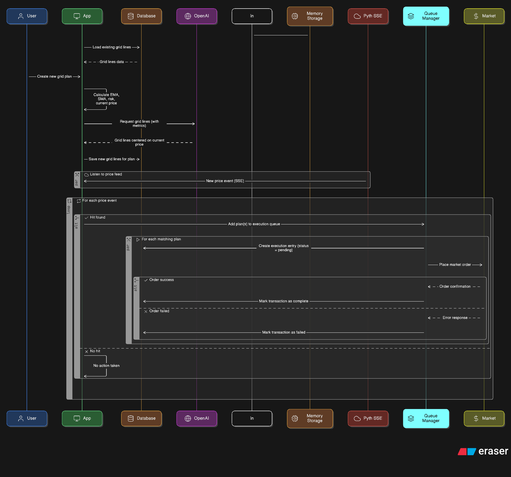

# Grid

A grid strategy works by creating a range of support/resistances based on past market sentiments.

These grid lines act as triggers for buy and sell actions

We enhance grid by offloading the work of generating grid to openai, we provide the ai with market sentiments like current price, emas, smas, `risk level` etc.

The AI responds with a range of grid lines with current price as the center.

Just like SDCA, we divide the strategy in two environments, mock and line.
For both Live and Mock, we use in memory store to efficiently query grid lines and reduce the chances of miss. Making the system significantly faster and reliable than solely relying on DB.

Unlike SDCA, we don't perform de-dupe here, since we're generating lines once per plan, so it's rather redundant to de-dupe in grid, unless we do that on a daily basis.

## Live Environment

Live environment uses real money to make realtime investments.

We're gonna abstract out some of the functionality under task queue, used to avoid certain block chain specific issues. It's same for all strategies.

It's performed in these steps:

1. System loads existing grid lines from db in memory
2. User creates a grid plan
3. Metrics such as mvas, emas are calculated
4. Metrics sent to openai to generate grid lines
5. Each plan has grid lines stored in db
6. Load grid lines in memory
7. Listen to Pyth's SSE events
   1. On each event, we query for a corresponding price and token composite key hit in memory
   2. The key will look like `tokenname:price` to perform [<u>**inverted query**</u>](#inverted-query)
   3. Each price is queried against a [<u>**relative threshold**</u>](#relative-threshold) to find a line hit
8. On a price hit we add the task to Queue Manager,
9. Queue Manager runs it's abstraction and executes the task
10. Execution of task includes 3 steps
    1. Creation of db entry with status = "pending"
    2. Placing a market order (in case of injective)
    3. Marking transaction completed or failed based on market order output

## Mock Environment

The execution model of mock environment is exactly the same as Live mode,
except we don't want for pyth's SSE to query, we iterate over 1h interval array of past 90D

We don't store these transactions in db to avoid clashes.

it operates as:

1. Fetch 1h interval 90D data
2. Calculate metrics
3. Fetch grid lines from OpenAi based on metrics
4. Store grid lines in DB
5. Load grid lines in memory
6. Iterate over each data point
   1. Query against data exacly like live plan
   2. Find all hits and return a list of mock transactions for that

## Glossary

There are very important concepts that are core to this strategy

#### Relative Threshold

When dealing with token prices having precision of upto 18 digits, it's almost impossible to find an exact match of the price we're looking for, which may cause the system to never execute the strategy.

To fix this issue, we use `thresholds` we say, that if the line price is 11.0922 inj, I'm read to place an order for any value between 11.1 and 11.0.5, giving our system some breathing room.

We could say that I'm ready to make a 0.01% slippage, for threshold, which will work fine.
But when it comes to extremely high prices tokens like bitcoin, a fixed threshold will fail.

0.01% slippage in bitcoin is `1191.82 USD` as of writing of this document. Which could be disasterous.

To avoid issues with that, we use "relative" thresholding, which simply says that we should provide a slippage that is relative to cost of token in USDT.
In simpler terms, instead of providing a constant threshold over token's amount, we provde a constant threshold on the USDT, say 1 USDT. So for any system, the threshold is 1USDT, or we can change it token specifc depeding on it's volatility.

#### Inverted Query

We may have 100 plans having a common grid line say 1000 INJ, so it'd be extremely inefficient to query for all plans that has a price line in that, then we'll have to perform a threshold query as well. Which is O(n2) time complexity.

To avoid this, we don't query grid lines in plans, instead we play plans in a grid line.

When we load plan's lines in memory, store it in a HashMap with
key: `{tokeName}:{price}`
value: `Set<ObjectId>`

each price has a list of corresponding plans that needs to be executed when the price hits, we can run each plan parallely asynchronously at outside wallet level. Dropping our work down from O(n) to O(1) not considering the threshold logic.

