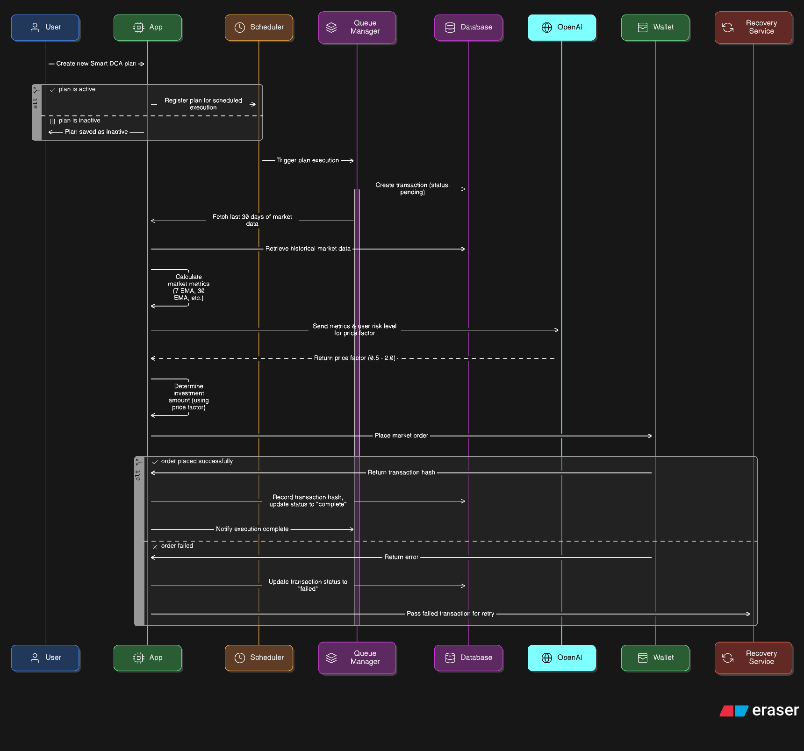

# SDCA - Smart DCA

SDCA is an improvement of DCA, which invest money on a defined time interval.
SDCA improves traditional DCA by introducing how much we invest on each execution depending on market sentiment.

We send market sentiments to openai and in return we ge a `price factor`

A `price factor` is a multiplier that lies withing a range of [0.5, 2]. It determines how much of the daily investment we should invest to get maximum profit,

for a low profit market, price factor is less, for a high profit market, we get a higher price factor.

Price factor is calculated using various metrics like 30mva, 7mva, 30ema, 7ema etc. One of the most important determination factor is `Risk Level` which is entered by the user, setting an upper and lower bound of maximum and minimum price.

The `price factor` we get from openai is multiplied with daily invesment to get optimal investment which should be invested on that execution.

We divide each strategy in two environments, a mock environment and a live environment
mock environment operates over past data, typically 90D range, and live operates over present and future with actual investments via user's wallet.

It's important to note that we don't store mock transactions in db to avoid clashes

## Live Environment

This works in following steps:

1. User creates a plan
2. If the plan is active, it's added to cron job with the time of execution
3. When it's time for execution, the job is added to queue manager
4. Queue manager executes the task when the slot is available in this order:
   1. Creation of transaction entry in db with status being pending
   2. Fetching data of last 30D
   3. Calculating metrics
   4. Fetching price factor from Open AI based on market sentiment (metrics)
   5. Place market order to buy decided quantity of token
5. Update txHash in db entry and set the status complete or failed
6. Failed transactions are passed to recovery service for retries.

## Mock Envitronment

Since mock data operates over past data, and if 10 users start mock for same chain, same token but for different amounts, we can perform some optimizations via de-duping and batching to get optimal results.

We're using openai batching to calculate price factors of 90D in minimum possible time, and then use de-duping to achieve 0 openai overhead in most cases once we have enough existing plans in our db.

Without de-duping and batching, using sequential requests, we'd have to query openai 90 times for just 1 plan, in under 1m giving us sweet 429s and making the system extremely expensive.

De-duping is performed via linking of a newly created plan with similar parameters to an existing data set.
Parameters include:

- Token Symbol
- Risk Level
- Chain

Note we didn't use amount here, since we can just multiply same `price factor` with different amounts, so after enough combinations of these 3, we'll get a 100% hitrate over existing batches.

Working:

1. User creates a plan
2. Check if an openai batch with same paramteres already exist:

- if batch exists, link this plan to that batch
- else create a new openai batch
  1. Fetch data of 120D, (extra 30d for first data point)
  2. Calculate metrics for each day (for 90D)
  3. Send batch `.jsonl` file to openai batch processor

3. Return batch status, pending or data
4. Query the batch every time a request is made

